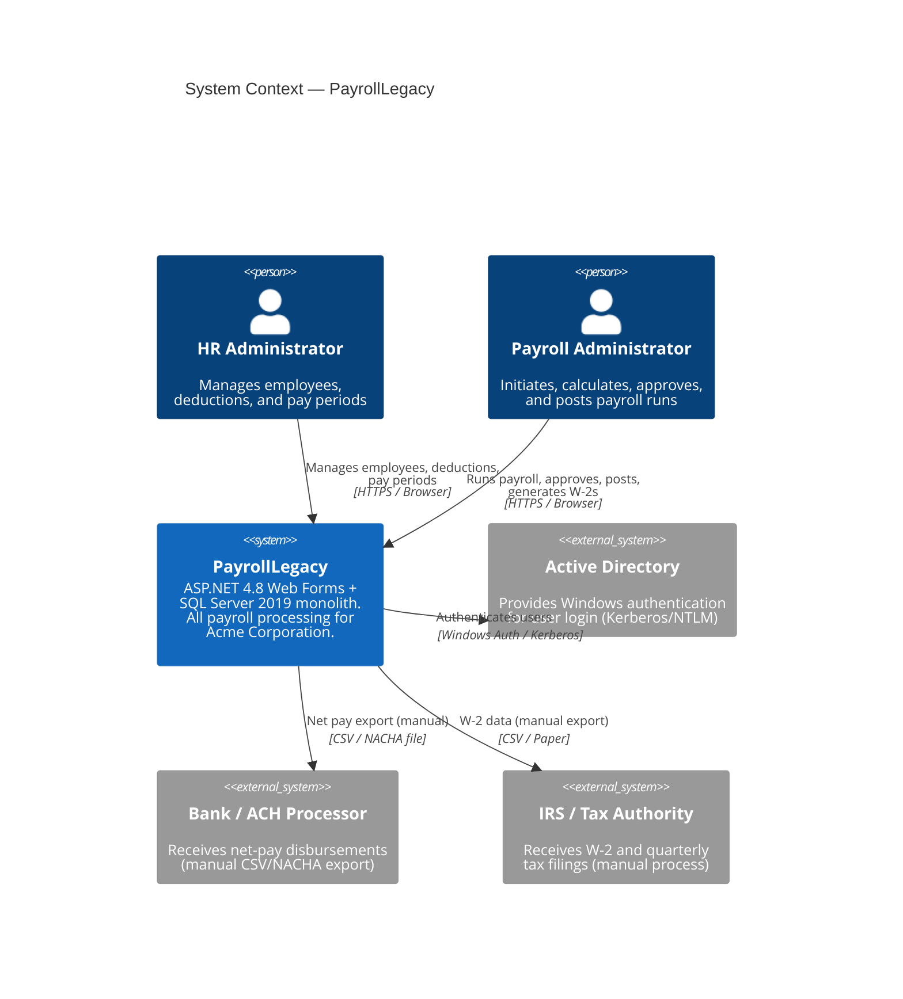
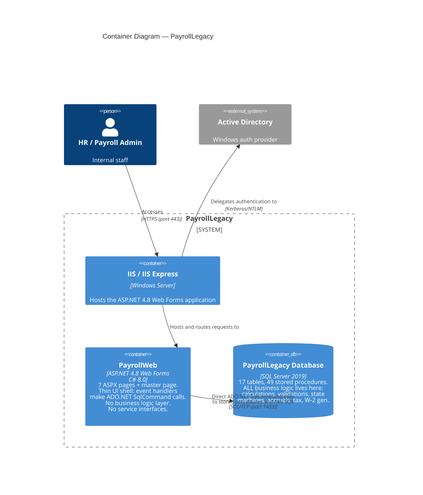

# Current State — C4 Architecture Diagrams (PayrollLegacy)

> All diagrams use [Mermaid](https://mermaid.js.org/) and render in GitHub Markdown.

---

## Level 1 — System Context



---

## Level 2 — Container Diagram



---

## Level 3 — Component Diagram: PayrollWeb (Web Forms App)

```mermaid
C4Component
    title Component Diagram — PayrollWeb (ASP.NET 4.8 Web Forms)

    Container_Boundary(webApp, "PayrollWeb") {
        Component(siteMaster, "Site.Master", "Master Page",
            "Shared navigation, layout,<br/>and CSS/JS includes")

        Component(defaultPage, "Default.aspx", "Web Form + Code-Behind",
            "Dashboard: KPIs, recent runs,<br/>open periods. Executes 5 inline<br/>SQL queries + 2 stored procs.<br/>String concatenation for year filter.")

        Component(employeesPage, "Employees.aspx", "Web Form + Code-Behind",
            "Employee list and search.<br/>Calls usp_Employee_Search<br/>(SQL INJECTION RISK).<br/>Duplicates status→label mapping.")

        Component(employeeDetailPage, "EmployeeDetail.aspx", "Web Form + Code-Behind",
            "Add/edit/terminate employees.<br/>DUPLICATES 2024 federal tax<br/>brackets from stored procs<br/>(lines 213-232). Magic FICA<br/>constants (0.062, 0.0145).")

        Component(payrollRunPage, "PayrollRun.aspx", "Web Form + Code-Behind",
            "Payroll run workflow: initiate,<br/>calculate, approve, post, void.<br/>Calls usp_Payroll_ProcessRun<br/>with CommandTimeout=300s.<br/>Business rule MaxOvertimeHours=80<br/>hardcoded in UI (not enforced).")

        Component(deductionsPage, "Deductions.aspx", "Web Form + Code-Behind",
            "Enroll/update/deactivate<br/>employee deductions.<br/>Calls usp_EmployeeDeduction_*.")

        Component(periodClosePage, "PeriodClose.aspx", "Web Form + Code-Behind",
            "Period close, accruals,<br/>year-end, W-2 view.<br/>SQL INJECTION: W-2 query<br/>concatenates tax year integer<br/>(line 146). Calls usp_YearEnd_Process.")

        Component(reportsPage, "Reports.aspx", "Web Form + Code-Behind",
            "5 payroll reports via<br/>usp_Report_* stored procs.<br/>AutoGenerateColumns=true;<br/>no column type safety.")
    }

    ContainerDb(sqlDb, "PayrollLegacy DB", "SQL Server 2019", "49 stored procs, 17 tables")

    Rel(defaultPage, sqlDb, "usp_Report_PayrollSummary,<br/>usp_PayPeriod_GetAll,<br/>+ 3 inline SQL queries", "ADO.NET")
    Rel(employeesPage, sqlDb, "usp_Employee_Search,<br/>usp_Department_GetAll", "ADO.NET")
    Rel(employeeDetailPage, sqlDb, "usp_Employee_GetById/Insert/Update<br/>/Terminate, usp_Tax_CalculateFederal", "ADO.NET")
    Rel(payrollRunPage, sqlDb, "usp_Payroll_InitiateRun/ProcessRun<br/>/ApproveRun/PostRun/VoidRun<br/>usp_PayrollRun_GetDetails", "ADO.NET")
    Rel(deductionsPage, sqlDb, "usp_EmployeeDeduction_*,<br/>usp_DeductionType_GetAll,<br/>usp_Employee_GetAll", "ADO.NET")
    Rel(periodClosePage, sqlDb, "usp_PayPeriod_Close,<br/>usp_Accrual_ProcessVacation/SickTime,<br/>usp_YearEnd_Process, raw SQL", "ADO.NET")
    Rel(reportsPage, sqlDb, "usp_Report_* (5 procs)", "ADO.NET")
```

---

## Level 3 — Component Diagram: PayrollLegacy Database

```mermaid
C4Component
    title Component Diagram — PayrollLegacy Database (SQL Server 2019)

    Container_Boundary(db, "PayrollLegacy Database") {

        Component(empProcs, "Employee Procedures", "T-SQL (9 procs)",
            "usp_Employee_GetAll/GetById/<br/>Insert/Update/Delete/Search/<br/>UpdateStatus/Terminate/Rehire.<br/>SMELL: usp_Employee_Insert has<br/>no TRY/CATCH. usp_Employee_Search<br/>uses dynamic SQL — SQL injection.")

        Component(payrollProcs, "Payroll Run Procedures", "T-SQL (6 procs)",
            "usp_Payroll_InitiateRun/<br/>ProcessRun/ApproveRun/PostRun/<br/>VoidRun + usp_PayrollRun_UpdateStatus.<br/>SMELL: ProcessRun is a god proc<br/>(260+ lines, 6 responsibilities,<br/>duplicated tax/deduction calc,<br/>magic accrual numbers).")

        Component(taxProcs, "Tax Calculation Procedures", "T-SQL (2 procs)",
            "usp_Tax_CalculateFederal,<br/>usp_Tax_CalculateState.<br/>SMELL: Logic duplicated verbatim<br/>inside usp_Payroll_ProcessRun<br/>AND in EmployeeDetail.aspx.cs.")

        Component(deductionProcs, "Deduction Procedures", "T-SQL (7 procs)",
            "usp_DeductionType_GetAll/Insert,<br/>usp_EmployeeDeduction_Enroll/<br/>Update/GetByEmployee,<br/>usp_Deduction_CalculateForEmployee,<br/>usp_Earnings_CalculateOvertime.<br/>SMELL: Logic duplicated in ProcessRun.")

        Component(periodProcs, "Pay Period Procedures", "T-SQL (4 procs)",
            "usp_PayPeriod_GetAll/GetById/<br/>Create + usp_PayPeriod_Close.<br/>SMELL: PayPeriod_Close has no<br/>transaction; audit failure doesn't<br/>roll back period status change.")

        Component(accrualProcs, "Accrual Procedures", "T-SQL (3 procs)",
            "usp_Accrual_ProcessVacation,<br/>usp_Accrual_ProcessSickTime,<br/>usp_Benefits_CalculateEmployerShare.<br/>SMELL: Magic accrual rates<br/>(6.15, 4.62, 3.08, 1.54 hrs/period).<br/>Employer share proc incomplete.")

        Component(yearEndProcs, "Year-End Procedures", "T-SQL (2 procs)",
            "usp_YearEnd_Process,<br/>usp_W2_Generate.<br/>SMELL: No outer transaction<br/>(W2 fail doesn't rollback YTD reset).<br/>W2 Box 1 incorrect (pre-tax not<br/>subtracted). SS wage base cap missing.")

        Component(reportProcs, "Reporting Procedures", "T-SQL (5 procs)",
            "usp_Report_PayrollSummary/<br/>EmployeeEarnings/TaxLiability/<br/>HeadcountByDepartment/<br/>DeductionsSummary.<br/>SMELL: TaxLiability has employer<br/>FICA calculation bug (lines 1915-1917).")

        Component(empTables, "Employee Tables", "SQL Server Tables",
            "Employees (SSN plaintext),<br/>EmployeeStatusHistory,<br/>Departments, PayGrades.<br/>Magic status integers.")

        Component(payrollTables, "Payroll Tables", "SQL Server Tables",
            "PayPeriods, PayrollRuns,<br/>PayrollRunDetails, TimeEntries.<br/>Magic status integers throughout.")

        Component(refTables, "Reference / Compliance Tables", "SQL Server Tables",
            "EarningsTypes, DeductionTypes,<br/>EmployeeDeductions, FederalTaxBrackets,<br/>StateTaxRates, VacationAccrualLedger,<br/>W2Records, AuditLog.")
    }

    Rel(empProcs, empTables, "CRUD")
    Rel(payrollProcs, empTables, "Read salary, status, filing info;<br/>UPDATE YTD on post")
    Rel(payrollProcs, payrollTables, "Full lifecycle R/W")
    Rel(payrollProcs, refTables, "Read tax brackets, deduction types;<br/>Write accrual ledger")
    Rel(payrollProcs, taxProcs, "Calls (but also duplicates inline)")
    Rel(payrollProcs, deductionProcs, "Calls (but also duplicates inline)")
    Rel(accrualProcs, empTables, "UPDATE VacationBalance, SickBalance")
    Rel(accrualProcs, refTables, "INSERT VacationAccrualLedger")
    Rel(yearEndProcs, empTables, "RESET YTD fields; CAP vacation balance")
    Rel(yearEndProcs, refTables, "INSERT W2Records")
    Rel(reportProcs, empTables, "SELECT (all employee data)")
    Rel(reportProcs, payrollTables, "SELECT (all payroll data)")
    Rel(reportProcs, refTables, "SELECT (deductions, audit log)")
```
