```mermaid
erDiagram

    %% ── REFERENCE / LOOKUP ──────────────────────────────────────────────

    Departments {
        int     DepartmentId    PK
        varchar DepartmentCode  UK  "e.g. EXEC, HR, FIN"
        varchar DepartmentName
        int     ManagerId       FK  "nullable → Employees"
        varchar CostCenter
        bit     IsActive
        datetime CreatedDate
        datetime ModifiedDate
    }

    PayGrades {
        int     PayGradeId   PK
        varchar GradeCode    UK  "G1–G8"
        varchar GradeTitle
        decimal MinSalary
        decimal MaxSalary
        bit     OvertimeEligible
        bit     IsActive
    }

    EarningsTypes {
        int     EarningsTypeId  PK
        varchar TypeCode        UK  "REG, OT15, OT20, HOL, VAC, SICK, BONUS..."
        varchar TypeName
        bit     IsTaxable
        bit     IsOvertimeEligible
        decimal MultiplierRate
        bit     IsActive
    }

    DeductionTypes {
        int     DeductionTypeId  PK
        varchar TypeCode         UK  "HEALTH_S, 401K, HSA, GARNISH..."
        varchar TypeName
        bit     IsPreTax
        bit     IsPercentage
        decimal DefaultAmount
        decimal MaxAnnualAmount  "nullable"
        bit     IsActive
        int     DisplayOrder
    }

    FederalTaxBrackets {
        int     BracketId    PK
        int     TaxYear
        varchar FilingStatus     "Single | Married | MarriedSeparate | HeadOfHousehold"
        decimal MinIncome
        decimal MaxIncome        "nullable = no upper bound"
        decimal TaxRate
        decimal BaseAmount
    }

    StateTaxRates {
        int     StateRateId         PK
        varchar StateCode           "CA, NY, TX, FL, WA, IL, GA, OH"
        int     TaxYear
        decimal FlatRate
        decimal StandardDeduction
    }

    %% ── EMPLOYEE MASTER ─────────────────────────────────────────────────

    Employees {
        int     EmployeeId      PK
        varchar EmployeeNumber  UK
        varchar FirstName
        varchar LastName
        varchar MiddleName      "nullable"
        varchar SSN             "⚠️ PLAIN TEXT — PII risk. No encryption."
        date    DateOfBirth
        date    HireDate
        date    TerminationDate "nullable"
        int     DepartmentId    FK
        int     PayGradeId      FK
        varchar PositionTitle
        decimal AnnualSalary
        decimal HourlyRate      "nullable"
        varchar PayFrequency    "Weekly | BiWeekly | SemiMonthly | Monthly"
        varchar FilingStatus    "Single | Married | ..."
        int     FederalAllowances
        varchar StateCode       "home state"
        varchar WorkState
        int     Status          "⚠️ MAGIC INT: 1=Active 2=Leave 3=Terminated 4=Suspended 5=Retired"
        int     EmploymentType  "⚠️ MAGIC INT: 1=FT 2=PT 3=Contractor 4=Seasonal"
        varchar Email           "nullable"
        varchar Phone           "nullable"
        varchar Address1        "nullable"
        varchar Address2        "nullable"
        varchar City            "nullable"
        varchar StateAddr       "nullable"
        varchar Zip             "nullable"
        decimal VacationBalance "⚠️ Denormalized — owned by Benefits domain"
        decimal SickBalance     "⚠️ Denormalized — owned by Benefits domain"
        decimal YTDGross        "⚠️ Denormalized — owned by Payroll domain"
        decimal YTDFederalTax   "⚠️ Denormalized — owned by Payroll domain"
        decimal YTDStateTax     "⚠️ Denormalized — owned by Payroll domain"
        decimal YTDSocialSecurity "⚠️ Denormalized"
        decimal YTDMedicare     "⚠️ Denormalized"
        decimal YTDDeductions   "⚠️ Denormalized"
        datetime CreatedDate
        datetime ModifiedDate
        varchar CreatedBy
        varchar ModifiedBy
    }

    EmployeeStatusHistory {
        int     StatusHistoryId  PK
        int     EmployeeId       FK
        int     OldStatus        "⚠️ MAGIC INT — see Employees.Status"
        int     NewStatus        "⚠️ MAGIC INT"
        datetime ChangeDate
        varchar ChangeReason     "nullable"
        varchar ChangedBy
    }

    EmployeeDeductions {
        int     EnrollmentId     PK
        int     EmployeeId       FK
        int     DeductionTypeId  FK
        decimal Amount
        bit     IsPercentage
        date    EffectiveDate
        date    EndDate          "nullable"
        bit     IsActive
        varchar Notes            "nullable"
        datetime CreatedDate
    }

    %% ── PAYROLL WORKFLOW ────────────────────────────────────────────────

    PayPeriods {
        int     PayPeriodId   PK
        varchar PeriodName    "e.g. 2024-01 Bi-Weekly"
        date    StartDate
        date    EndDate
        date    PayDate
        int     FiscalYear
        int     PeriodNumber
        int     Status        "⚠️ MAGIC INT: 1=Open 2=Processing 3=Closed 4=Reopened"
        varchar FrequencyType "BiWeekly | Weekly | SemiMonthly | Monthly"
        datetime CreatedDate
    }

    PayrollRuns {
        int     RunId          PK
        int     PayPeriodId    FK
        int     RunNumber
        int     RunType        "⚠️ MAGIC INT: 1=Regular 2=Supplemental 3=Bonus 4=Correction"
        int     Status         "⚠️ MAGIC INT: 1=Draft 2=Processing 3=Calculated 4=Approved 5=Posted 6=Voided"
        decimal TotalGross
        decimal TotalFederalTax
        decimal TotalStateTax
        decimal TotalSSEmployee
        decimal TotalMedicare
        decimal TotalDeductions
        decimal TotalNetPay
        int     EmployeeCount
        datetime ProcessedDate  "nullable"
        datetime ApprovedDate   "nullable"
        datetime PostedDate     "nullable"
        datetime VoidedDate     "nullable"
        varchar ApprovedBy      "nullable"
        varchar PostedBy        "nullable"
        varchar VoidReason      "nullable"
        varchar Notes           "nullable"
        datetime CreatedDate
        varchar CreatedBy
    }

    PayrollRunDetails {
        int     DetailId         PK
        int     RunId            FK
        int     EmployeeId       FK
        decimal RegularHours
        decimal OvertimeHours
        decimal HolidayHours
        decimal VacationHours
        decimal SickHours
        decimal RegularPay
        decimal OvertimePay
        decimal HolidayPay
        decimal VacationPay
        decimal SickPay
        decimal BonusPay
        decimal OtherEarnings
        decimal GrossPay
        decimal PreTaxDeductions
        decimal TaxableGross
        decimal FederalTax
        decimal StateTax
        decimal SocialSecurity
        decimal Medicare
        decimal PostTaxDeductions
        decimal NetPay
        varchar CheckNumber      "nullable"
        int     Status           "⚠️ MAGIC INT: 1=Calculated 2=Approved 3=Posted 4=Voided"
        varchar ErrorMessage     "nullable — populated on calculation error"
        datetime CalculatedDate  "nullable"
    }

    TimeEntries {
        int     TimeEntryId   PK
        int     EmployeeId    FK
        int     PayPeriodId   FK
        date    EntryDate
        decimal RegularHours
        decimal OvertimeHours
        decimal HolidayHours
        decimal VacationHours
        decimal SickHours
        varchar Notes         "nullable"
        int     ApprovedBy    "nullable — FK to Employees (manager)"
        datetime ApprovedDate "nullable"
        int     Status        "⚠️ MAGIC INT: 1=Pending 2=Approved 3=Rejected"
        datetime CreatedDate
    }

    VacationAccrualLedger {
        int     AccrualId       PK
        int     EmployeeId      FK
        int     PayPeriodId     FK
        varchar AccrualType     "Vacation | Sick | PTO"
        decimal HoursAccrued
        decimal HoursUsed
        decimal HoursAdjusted
        decimal BalanceBefore
        decimal BalanceAfter
        datetime TransactionDate
        varchar Notes           "nullable"
    }

    %% ── YEAR-END & COMPLIANCE ────────────────────────────────────────────

    W2Records {
        int     W2Id              PK
        int     EmployeeId        FK
        int     TaxYear
        decimal Box1_Wages        "⚠️ Pre-tax deductions NOT subtracted (bug in usp_W2_Generate)"
        decimal Box2_FedTax
        decimal Box3_SS_Wages     "⚠️ SS wage base cap ($168,600) NOT applied"
        decimal Box4_SS_Tax
        decimal Box5_Med_Wages
        decimal Box6_Med_Tax
        varchar Box12a_Code       "nullable — D for 401k"
        decimal Box12a_Amount     "nullable — incorrect formula in usp_W2_Generate"
        decimal Box16_StateWages
        decimal Box17_StateTax
        datetime GeneratedDate
        varchar GeneratedBy
    }

    AuditLog {
        int     AuditId      PK
        varchar TableName
        int     RecordId
        varchar Action       "INSERT | UPDATE | DELETE"
        varchar ColumnName   "nullable"
        varchar OldValue     "nullable — MAX"
        varchar NewValue     "nullable — MAX"
        varchar ChangedBy
        datetime ChangedDate
        varchar IPAddress    "nullable"
        varchar SessionId    "nullable"
    }

    %% ── RELATIONSHIPS ────────────────────────────────────────────────────

    Departments         ||--o{  Employees               : "employs"
    Departments         }o--o|  Employees               : "managed by (ManagerId)"
    PayGrades           ||--o{  Employees               : "grades"
    Employees           ||--o{  EmployeeStatusHistory   : "has status history"
    Employees           ||--o{  EmployeeDeductions      : "enrolled in"
    DeductionTypes      ||--o{  EmployeeDeductions      : "type of"
    Employees           ||--o{  PayrollRunDetails        : "paid in"
    Employees           ||--o{  TimeEntries             : "submits"
    Employees           ||--o{  VacationAccrualLedger   : "accrues"
    Employees           ||--o{  W2Records               : "receives"
    PayPeriods          ||--o{  PayrollRuns             : "contains"
    PayPeriods          ||--o{  TimeEntries             : "in period"
    PayPeriods          ||--o{  VacationAccrualLedger   : "processed in"
    PayrollRuns         ||--o{  PayrollRunDetails        : "details"
```

# Current State — Entity-Relationship Diagram (PayrollLegacy Database)

> Mermaid ER diagram for all 17 tables in `schema.sql`.  
> ⚠️ marks known data quality / compliance issues.

---

---

## Cross-Domain Ownership Anomalies

The following columns violate domain ownership boundaries and are migration targets:

| Column | Current Table | Should Be Owned By | Issue |
|---|---|---|---|
| `Employees.VacationBalance` | Employee Management | Benefits & Accruals | Benefits domain writes this; Employee domain should not own balance state |
| `Employees.SickBalance` | Employee Management | Benefits & Accruals | Same as above |
| `Employees.YTDGross` through `YTDDeductions` | Employee Management | Payroll Processing | YTD state is a Payroll concern; posted by `usp_Payroll_PostRun` |
| `Employees.SSN` | Employee Management | — | Stored as plain text; see ADR 0006 |
| `PayrollRunDetails.Status` | Payroll Processing | — | Magic integers; see ADR 0005 |
