# Current State — Payroll Run Lifecycle Sequence Diagram

> This diagram traces the full lifecycle of a payroll run from initiation through posting,  
> including the god-procedure internals of `usp_Payroll_ProcessRun`.

---

## Full Lifecycle

```mermaid
sequenceDiagram
    actor Admin as Payroll Admin
    participant UI as PayrollRun.aspx<br/>(Code-Behind)
    participant DB as SQL Server<br/>(PayrollLegacy DB)
    participant Emp as Employees table
    participant TE as TimeEntries table
    participant PRun as PayrollRuns table
    participant PDet as PayrollRunDetails table
    participant Accrual as VacationAccrualLedger table
    participant Periods as PayPeriods table

    Note over Admin,Periods: ── PHASE 1: Initiate Run ──────────────────────────────────────

    Admin->>UI: Select pay period + run type<br/>Click "Initiate Run"
    UI->>DB: EXEC usp_Payroll_InitiateRun<br/>(@PayPeriodId, @RunType=1, @Notes, @CreatedBy)
    activate DB
    DB->>Periods: SELECT Status — must be 1(Open) or 4(Reopened)
    DB->>PRun: SELECT — check no Regular run exists for period
    DB->>DB: BEGIN TRANSACTION
    DB->>PRun: INSERT PayrollRuns (Status=1 Draft)
    DB->>Periods: UPDATE Status = 2 (Processing)
    DB->>DB: COMMIT
    DB-->>UI: OUTPUT @NewRunId
    deactivate DB
    UI->>UI: Redirect to ?runId=NewRunId

    Note over Admin,Periods: ── PHASE 2: Calculate / Process ──────────────────────────────

    Admin->>UI: Click "Process / Calculate"
    UI->>DB: EXEC usp_Payroll_ProcessRun<br/>(@RunId, @ProcessedBy)<br/>[CommandTimeout = 300 seconds]
    activate DB

    DB->>PRun: Validate Status ∈ {1=Draft, 3=Calculated}
    DB->>PRun: UPDATE Status = 2 (Processing)

    DB->>Emp: SELECT all Active(1) + OnLeave(2) employees

    loop For each employee (sequential cursor — no parallelism)

        DB->>Emp: SELECT salary, hourlyRate, payFrequency,<br/>filingStatus, stateCode, payGradeId

        DB->>TE: SELECT SUM(RegularHours), SUM(OvertimeHours),<br/>SUM(HolidayHours), SUM(VacationHours), SUM(SickHours)<br/>WHERE EmployeeId=X AND PayPeriodId=Y AND Status=2

        alt No approved time entries found
            DB->>DB: Default hours: Regular=80 (BiWeekly),<br/>Overtime=0, Holiday/Vac/Sick=0
        end

        Note over DB: ⚠️ SMELL: Following logic duplicates<br/>usp_Earnings_CalculateOvertime
        DB->>DB: If HourlyRate IS NULL: derive from salary<br/>(AnnualSalary / 26 / 80 for BiWeekly)
        DB->>DB: RegularPay = HourlyRate × RegularHours
        DB->>DB: OvertimePay = HourlyRate × 1.5 × OvertimeHours<br/>(if OvertimeEligible=1, else 0)
        DB->>DB: EffectiveHourly = RegularPay / RegularHours
        DB->>DB: HolidayPay = EffectiveHourly × HolidayHours
        DB->>DB: VacationPay = EffectiveHourly × VacationHours
        DB->>DB: SickPay = EffectiveHourly × SickHours
        DB->>DB: GrossPay = RegularPay + OvertimePay +<br/>HolidayPay + VacationPay + SickPay

        Note over DB: ⚠️ SMELL: Following logic duplicates<br/>usp_Deduction_CalculateForEmployee
        DB->>DB: SELECT active EmployeeDeductions (IsActive=1,<br/>EndDate IS NULL or ≥ today)
        DB->>DB: PreTaxTotal = SUM(IsPreTax deductions)<br/>PostTaxTotal = SUM(post-tax deductions)<br/>(% deductions: Amount × GrossPay / 100)

        DB->>DB: TaxableGross = GrossPay − PreTaxTotal
        DB->>DB: AnnualizedTaxable = TaxableGross × PeriodsPerYear

        Note over DB: ⚠️ SMELL: Following logic duplicates<br/>usp_Tax_CalculateFederal AND usp_Tax_CalculateState
        DB->>DB: SELECT bracket from FederalTaxBrackets<br/>WHERE TaxYear=2024 AND FilingStatus=X<br/>AND AnnualizedTaxable BETWEEN Min AND Max
        DB->>DB: AnnualFedTax = BaseAmount +<br/>(AnnualizedTaxable − MinIncome) × TaxRate
        DB->>DB: PerPeriodFedTax = AnnualFedTax / PeriodsPerYear

        DB->>DB: SELECT FlatRate, StandardDeduction<br/>FROM StateTaxRates WHERE StateCode=X AND TaxYear=2024
        DB->>DB: AnnualStateTax = MAX(0,<br/>(AnnualizedTaxable − StdDed) × FlatRate)
        DB->>DB: PerPeriodStateTax = AnnualStateTax / PeriodsPerYear

        Note over DB: ⚠️ SMELL: Magic FICA constants<br/>hardcoded — not in any config table
        DB->>DB: SocialSecurity = TaxableGross × 0.062
        DB->>DB: Medicare = TaxableGross × 0.0145

        DB->>DB: NetPay = GrossPay − PreTaxTotal − FedTax<br/>− StateTax − SocialSecurity − Medicare − PostTaxTotal

        alt Calculation succeeds
            DB->>PDet: UPSERT PayrollRunDetails<br/>(UPDATE if exists, INSERT if new)
        else Calculation error (CATCH block)
            DB->>PDet: UPDATE Status=4(Voided),<br/>ErrorMessage=ERROR_MESSAGE()
            Note over DB: ⚠️ Run continues with next employee<br/>No outer transaction — partial results persist
        end

    end

    DB->>PRun: UPDATE TotalGross/TotalFedTax/.../EmployeeCount<br/>= SUM/COUNT from PayrollRunDetails

    Note over DB: ⚠️ SMELL: Accruals inline in process run<br/>Also exist as separate usp_Accrual_* procs
    DB->>Emp: UPDATE VacationBalance += accrual<br/>(tenure-based magic numbers:<br/>≥10yr→6.15, ≥5yr→4.62, ≥2yr→3.08, <2yr→1.54)
    DB->>Emp: UPDATE SickBalance += 1.54 (flat, all employees)
    DB->>Accrual: INSERT VacationAccrualLedger rows

    DB->>PRun: UPDATE Status = 3 (Calculated)
    DB-->>UI: (success — no return value)
    deactivate DB

    UI->>DB: EXEC usp_PayrollRun_GetDetails (@RunId)
    DB-->>UI: Result set 1: run header (totals, status)<br/>Result set 2: detail lines per employee
    UI->>Admin: Display run totals table + employee detail grid

    Note over Admin,Periods: ── PHASE 3: Approve ──────────────────────────────────────────

    Admin->>UI: Click "Approve"
    UI->>DB: EXEC usp_Payroll_ApproveRun<br/>(@RunId, @ApprovedBy, @Notes)
    activate DB
    DB->>PRun: Validate Status = 3 (Calculated)
    DB->>DB: BEGIN TRANSACTION
    DB->>PRun: UPDATE Status=4(Approved), ApprovedDate=NOW(), ApprovedBy
    DB->>PDet: UPDATE Status=2(Approved) WHERE RunId=X AND Status=1
    DB->>DB: COMMIT
    DB-->>UI: (success)
    deactivate DB

    Note over Admin,Periods: ── PHASE 4: Post ─────────────────────────────────────────────

    Admin->>UI: Click "Post"
    UI->>DB: EXEC usp_Payroll_PostRun (@RunId, @PostedBy)
    activate DB
    DB->>PRun: Validate Status = 4 (Approved)
    DB->>DB: BEGIN TRANSACTION
    loop For each PayrollRunDetail row in this run
        DB->>Emp: UPDATE YTDGross += GrossPay<br/>YTDFederalTax += FederalTax<br/>YTDStateTax += StateTax<br/>YTDSocialSecurity += SocialSecurity<br/>YTDMedicare += Medicare<br/>YTDDeductions += PreTax + PostTax
    end
    DB->>PDet: UPDATE Status=3(Posted) WHERE RunId=X
    DB->>PRun: UPDATE Status=5(Posted), PostedDate=NOW(), PostedBy
    DB->>DB: COMMIT
    DB-->>UI: (success)
    deactivate DB
    UI->>Admin: Display "Run posted. YTD balances updated."

    Note over Admin,Periods: ── ALTERNATE PATH: Void ──────────────────────────────────────

    Admin->>UI: Click "Void" (at any stage)
    UI->>DB: EXEC usp_Payroll_VoidRun<br/>(@RunId, @VoidedBy, @VoidReason)
    activate DB
    alt Run was Posted (Status=5)
        DB->>DB: BEGIN TRANSACTION
        loop For each PayrollRunDetail row
            DB->>Emp: UPDATE YTD fields -= (reverse the post)
        end
        DB->>PDet: UPDATE Status=4(Voided)
        DB->>PRun: UPDATE Status=6(Voided), VoidedDate, VoidReason
        DB->>DB: COMMIT
    else Run was not yet Posted
        DB->>PDet: UPDATE Status=4(Voided)
        DB->>PRun: UPDATE Status=6(Voided), VoidedDate, VoidReason
        Note over DB: ⚠️ No transaction for non-posted void
    end
    DB-->>UI: (success)
    deactivate DB
```

---

## Notable Pain Points Visible in This Sequence

| # | Location | Problem |
|---|---|---|
| 1 | `usp_Payroll_ProcessRun` body | All earnings, deduction, and tax logic is duplicated inline — already exists in dedicated procs (`usp_Earnings_CalculateOvertime`, `usp_Deduction_CalculateForEmployee`, `usp_Tax_Calculate*`) |
| 2 | Employee loop in ProcessRun | Sequential cursor — no parallelism. 20 employees × ~15 queries each = 300+ SQL round trips per run |
| 3 | Accrual update in ProcessRun | Vacation/sick accrual is buried inside the payroll calculation proc. If accrual is run separately via `usp_Accrual_ProcessVacation`, it double-accrues |
| 4 | No outer transaction in ProcessRun | If the proc crashes after 10 employees, 10 employees have `PayrollRunDetails` rows, 10 do not. The run is left in `Processing` status indefinitely |
| 5 | CommandTimeout = 300s | The 5-minute timeout is a symptom of the sequential cursor. Blocking the HTTP request for 5 minutes is a UX and reliability risk |
| 6 | Void of non-posted run | No transaction guard — `PayrollRunDetails` and `PayrollRuns` could be partially updated |
