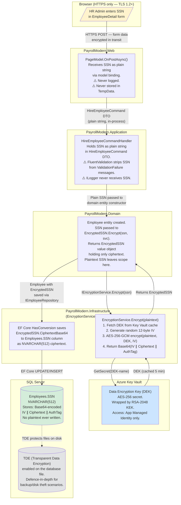
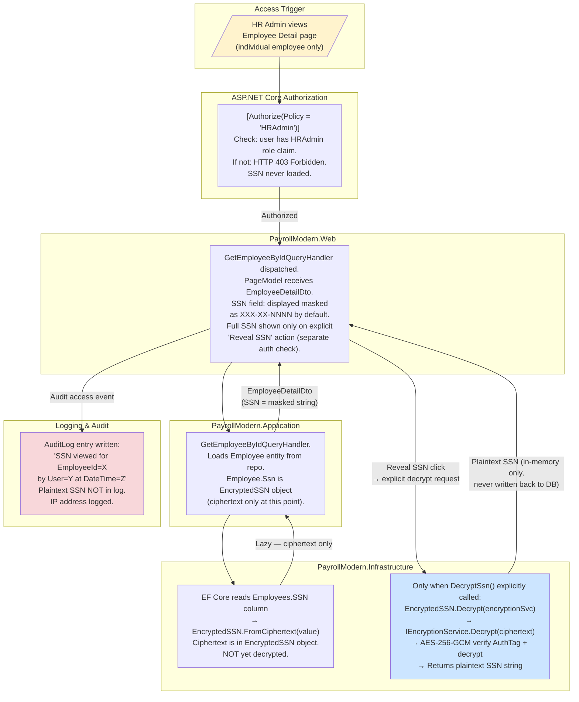
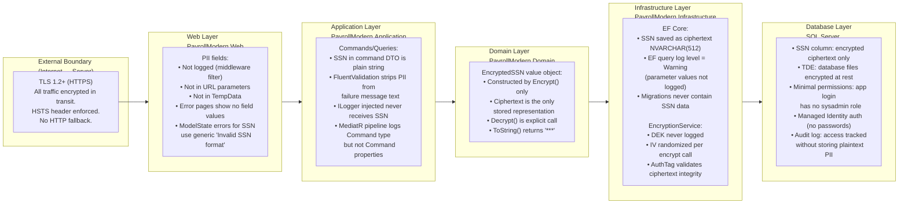
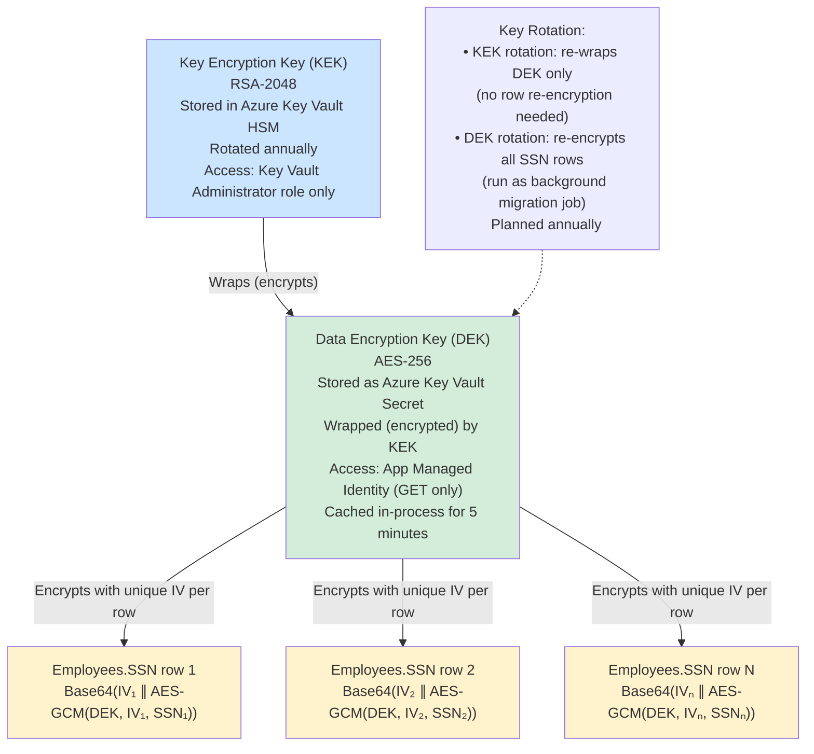

# Target State — PII Data Flow and Encryption Map (PayrollModern)

> This document shows how PII fields (primarily Social Security Numbers) flow through  
> the modernized application layers, where encryption is applied, and where access is controlled.

---

## PII Field Classification

| Field | Table | Classification | Treatment |
|---|---|---|---|
| `SSN` | `Employees` | **High** — identity theft risk, regulatory | AES-256-GCM encrypted at application layer |
| `DateOfBirth` | `Employees` | **Medium** — health inference risk | Stored as DATE (plaintext); no search by DOB in queries |
| `FirstName`, `LastName` | `Employees` | **Medium** — name + payroll data combined is sensitive | Stored plaintext; masked in logs |
| `Address1`–`Zip` | `Employees` | **Medium** — home address | Stored plaintext; HTTPS in transit |
| `Email`, `Phone` | `Employees` | **Low–Medium** — contact PII | Stored plaintext; used for notifications |
| `AnnualSalary` | `Employees` | **Medium** — financial PII | Stored plaintext; access-controlled via authorization policy |
| `GrossPay`, `NetPay` | `PayrollRunDetails` | **Medium** — compensation data | Stored plaintext; read access limited to PayrollAdmin role |
| `Box1_Wages` through `Box17_StateTax` | `W2Records` | **Medium** — tax/compensation | Stored plaintext; PayrollAdmin only |

---

## SSN Lifecycle Data Flow

---

## SSN Read / Decrypt Flow

---

## PII Boundary Controls by Layer

---

## Encryption Key Hierarchy

---

## What Does NOT Flow to the Database in Plaintext

| Data | Plaintext in Legacy | Plaintext in Modern |
|---|---|---|
| SSN | Yes (`VARCHAR(11)`) | No — AES-256-GCM ciphertext in `NVARCHAR(512)` |
| Date of Birth | Yes | Yes (plaintext — no current mandate to encrypt) |
| Salary | Yes | Yes (access-controlled via authorization) |
| Stack traces | Yes (via customErrors=Off) | No — generic error page; traces to server logs only |
| Tax calculation inputs | Visible in SQL Profiler | Parameterized — parameter values not in EF log at Warning level |
| SSN in application logs | Possible (no filtering) | No — `ILogger` calls never receive SSN; middleware filter as backstop |
